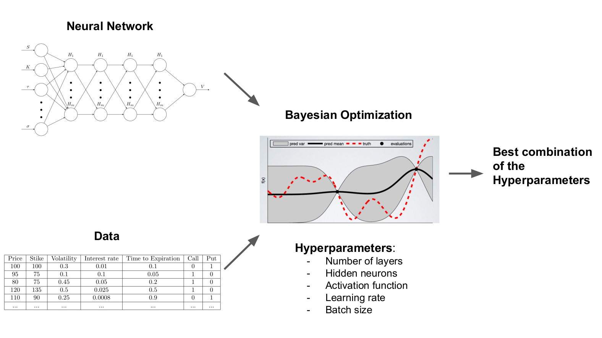
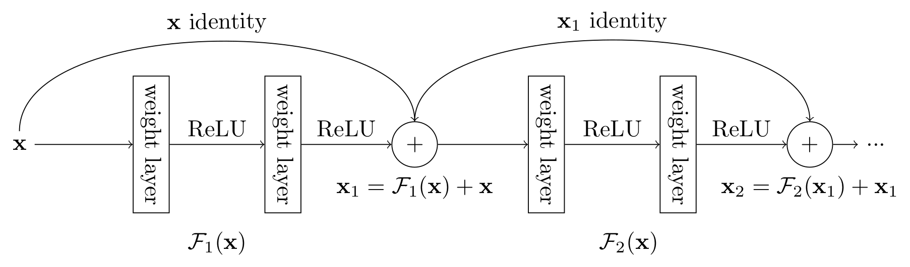
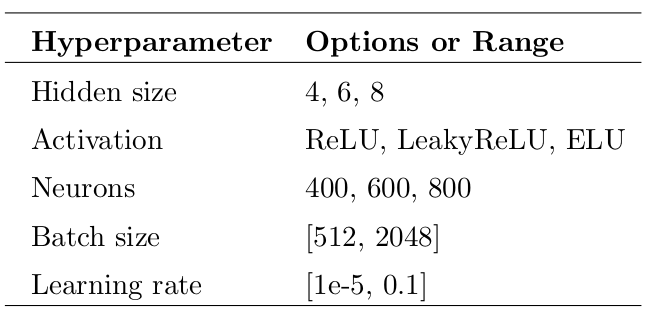

# Option pricing via Hyperparamter Optimization of Deep Learning

## Abstract

 > Nowadays, the increasing availability of data and access to computational resources is making the application of Deep Learning easier. Its application regards not only domains characterized by a high signal-to-noise ratio, but also other domains characterized by a higher uncertainty, such as the Financial sector. 
 > 
 > One of the most challenging problems in finance is the pricing of options.
Given the competitiveness of a market-making environment, it is essential to quickly quote option prices coherently with an ever-changing market environment. Fixed parametric models do not respond to structural changes in the data like newer machine learning models do. This thesis proposes a data-driven approach to tackle this problem, leveraging the power of Artificial Neural Networks and Bayesian Optimization. 
 > 
 > The programming language used for this work is Python with the support of Data science libraries such as NumPy, Pandas, Jupyter Notebook and PyTorch.
 > 
 > Finding the best hyperparameters for a model often involves tons of trials by hand or preliminary knowledge of experts, which can be efficient in selecting influential parameters and narrowing down the search space.   This can be avoided using a probabilistic hyperparameter optimization framework, such as Bayesian Optimization, which provides a robust configuration of the model's hyperparameters. 
The resulting Neural Networks aren't only trained on data generated from well-known pricing models for American Options, but also on real market data, to fully prove that they can be considered universal function approximators, given enough training data. 
 > 
 > The numerical results apart from showing that the Neural Network pricer can approximate, with an excellent degree of accuracy, any given pricing model, show how the Deep learning model is sensitive to small variations of the input data. 

---

If you're interested to the thesis, here's the [full thesis](https://paolodelia99.github.io/Bachelor_Thesis.pdf) and the [short presentation of the work](https://paolodelia99.github.io/thesis_presentation.pdf).

Here's an overview of how the whole process works:

## Architecture

The model architecture decided to use is a fully connected neural network with a residual 
connection every two layers. Residual connections have been added because they help to 
preserve the magnitude of the gradient across layers ([Alireza Zaeemzadeh, Nazanin Rahnavard e Mubarak Shah.](https://arxiv.org/abs/1805.07477.pdf)).

## Bayesian Optimization

[Bayesian Optimization](https://arxiv.org/abs/1807.02811.pdf) (**BO**) has been used as a hyperparameter optimization algorithm because 
it provides a sequential probabilistic framework that balances exploration and exploitation. This property, most of the time, allows getting not only a suitable configuration 
of the hyperparameters but also a robust configuration.

The following table shows the hyperparamters to optimize during the HPO phase:

The strategy used is the following:

- In the first 10 iterations of the optimization 10 casual model are generated (using a Sobol sequence)
- while $n \le N$:
  - the posterior probability distribution on  $f$ is updated using all available data
  - a new point $x_n$ is sampled based on the acquisition function
  - observe $y_n = f(x_n)$
  - $n++$
- return the best hyperparameter configuration

Where $N$ is the maximum number of iterations, in my case is fixed to 50.

## Data

The data used to train the different nets is 

- Binomial-Trinomial dataset: synthetic data generated using the binomial and trinomial models. 
- Heston dataset: synthetic data generated using the Heston model.
- Real Data: data about the option of 8 American stocks have been gathered for the months of April 2022 and May 2022.

## Project Content

- [Option & the Greeks](notebooks/Options.ipynb)
- [Option's trading strategies](notebooks/Options-Strategies.ipynb)
- Pricing models
  - [Binomial Model](pricing_models/bomp.py)
  - [Trinomial Model](pricing_models/trinomial_tree.py)
  - [Heston model with LSMC](notebooks/tff-lsmc-option-generator-heston-calls.ipynb)
- HPO notebooks
  - [Bayesian Optimization Binomial/Trinomial dataset](notebooks/AX_HPO_binomial_trinomial.ipynb)
  - [Bayesian Optimization Heston dataset](notebooks/AX_HPO_heston.ipynb)
  - [Bayesian Optimization on real option data](notebooks/AX_HPO_real_data.ipynb)
- Final Models
  - [Final Binomial-Trinomial Model](notebooks/Final-Model-BinTri.ipynb)
  - [Final Heston Model](notebooks/Final-Model-Heston.ipynb)
  - [Final Real Data Model](notebooks/Final-Model-Real-Data.ipynb)
- [IV Surface Notebook](notebooks/Finding_IV_Heston.ipynb)
- Greeks Notebooks
  - [Binomial/Trinomial Model Greeks](notebooks/Finding_the_option's_greeks_BinTri.ipynb)
  - [Heston Model Greeks](notebooks/Finding_the_option's_greeks_Heston.ipynb)

## Quickstart

Clone the repo

    git clone https://github.com/paolodelia99/thesis-option-pricing-with-deep-learning.git

If you want to generate synthetic data, run the following

    python generate_synthetic_data.py -t <type of dataset> (bin for Binomial model data, tri for trinomial model data)

For the heston synthetic data refer to the following notebook:
[heston call option synthetic data generation](notebooks/tff_lsmc_option_generator_heston_calls.ipynb) and 
[heston put option synthetic data generation](notebooks/tff_lsmc_option_generator_heston_puts.ipynb)

# Author 

Paolo D'Elia
